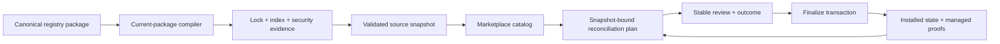

# Design: canonical remediation after live acceptance

Status: accepted — implementation in progress.

Inputs: the findings in
[PROGRESS-live-acceptance.md](../testing/PROGRESS-live-acceptance.md). This is a product design,
not a patch list: it treats the findings as evidence of a few broken boundaries.

## 1. Decision

AART becomes a single, current-protocol product. It does not parse, write, advertise, or route a
legacy catalog or a retired protocol revision in normal operation.

- A registry, source, artifact object, installation state, and setup recipe must be valid for the
  one current revision of their own protocol family before they cross a boundary.
- AART never guesses a legacy shape, performs a silent conversion, or carries a compatibility flag.
  A source or consumer must be re-authored to the current contract before AART accepts it.
- `setup` currently has an explicit current revision of `2`; therefore recipe revision `1` is
  invalid everywhere, including registry authoring and source snapshots.
- The current native registry/source protocol is not made legacy merely because its document name
  ends in `v1`. A protocol revision is retired only when its successor and its migration decision
  exist. This remediation removes the actual 0.1 legacy-catalog surface and retired setup v1.

The old `upstream` family, legacy top-level consumer verbs, legacy catalog readers/writers, and
their active documentation are removed rather than retained as adapters. Historic release notes may
remain as historical records, but must never be linked as supported instructions or imported by
runtime code.

## 2. What the findings say

| Structural residue | Findings | Architectural response |
|---|---|---|
| Two incompatible products coexist in one binary: legacy catalog and canonical marketplace. | LAF-01, 04, 05, 06, 09, 11, 12, 14, 21 | Delete the legacy runtime/CLI/TUI branch; expose one canonical command family and one workspace predicate. |
| An artifact can pass publication but fail when consumed. | LAF-02, 03, 08, 15, 24, 27 | Put one strict package compiler before every publication and consumption boundary. A valid package is valid end-to-end. |
| Installed state is compared only partly and finalization is reported independently of durable state. | LAF-13, 16, 17, 18, 19, 20, 25, 26 | Use one snapshot-bound reconciliation plan for status, check, update, prune, uninstall, review, and outcome rendering. |
| An artifact may be structurally valid but not runnable with its required siblings. | LAF-23 | Make artifact dependencies first-class, validated registry data and resolve their transitive closure before review. |
| Consent and interaction details do not have one reliable control boundary. | LAF-07, 10, 22 | Make command review/finalize the only mutation contract; make TUI cancellation explicit and treat a TUI as human-only policy, not a security control. |

The required change is consequently a boundary consolidation, not twenty-seven isolated edits.

## 3. Target architecture

No edge bypasses the compiler. In particular, the setup engine does not become a second package
validator, and the TUI does not become a second command implementation.

### 3.1 Current-package compiler

Introduce one pure compiler over an artifact package tree. It is used by registry validation, lock,
build, audit, source snapshot compilation, object materialization, security input export, install
planning, and setup planning.

It validates, in one pass:

- manifest identity, effect, profile, scope, licence/provenance policy, and primary payload;
- complete payload semantics (for example, an actionable hook rather than `{}`);
- declared setup recipe using the same `parse_installer` implementation as setup planning;
- the package-root `SETUP.md` required by a v2 recipe; and
- declared dependencies and their version/source constraints.

`SETUP.md` becomes an allowed canonical package-root file. A v2 setup package therefore passes
registry build and consumer setup under the same rule. A package with a setup declaration is not
installable until its setup object has compiled; failed setup validation prevents payload effects,
so a failed install cannot leave an MCP configuration behind.

The compiler returns an immutable `CompiledArtifact` with canonical object bytes, all digest inputs,
setup metadata, dependency metadata, and structured diagnostics. Lock/index/security code consumes
this value instead of reparsing adjacent files independently.

### 3.2 One canonical interface

The public command set is the canonical registry/source/marketplace interface. There is no legacy
`upstream` family and no second top-level consumer lifecycle family. The TUI dispatches the same
application requests as flag mode.

Canonical authoring gains non-interactive equivalents for all current maintainer actions now hidden
in the TUI, especially native promotion/import. These commands write only canonical packages and
always pass through the compiler before review/finalize.

An empty Git checkout is not classified as a registry. A maintainer workspace is canonical only
when its current registry marker exists; otherwise the TUI presents a neutral/project onboarding
surface. There is no legacy fallback predicate.

### 3.3 Reconciliation as one domain operation

Create a pure `ReconciliationPlan` from:

- the selected manifest-v2 installations and their managed proofs;
- one already-validated source snapshot per recorded subscription; and
- requested profile, scope, coordinates, desired dependency closure, and prune policy.

For every installation it emits exactly one state:

`current`, `update_available`, `removed_upstream`, `source_unavailable`, `local_drift`,
`broken`, `conflict`, or `failed`.

`marketplace status` and `check` consume the latest locally available validated snapshot; they do
not fetch. `source sync` is the explicit operation that advances that snapshot. This makes upstream
change/removal visible without making status a network action.

`marketplace update` with no coordinate reconciles every installation in the chosen scope/profile;
it never raises an exception. With coordinates, it reconciles the exact selected installations.
`--prune` means that the reviewed desired set is authoritative: every installed item in the selected
scope/profile which is absent upstream or omitted from that desired set is presented as a removal.
No removal occurs without the ordinary review/finalize preconditions.

The same plan drives status, update, prune, uninstall, review JSON, and final outcome. It contains
only stable semantic values: source revision, object/manifest/payload digests, selected keys,
policy, and destination proofs. TTL, clock values, formatting order, and a fresh sync are excluded
from its digest. Finalize re-computes the plan and refuses if a precondition differs.

### 3.4 One transaction and truthful outcome

Finalize applies an ordered transaction: revalidate plan proofs, change managed effects, write state
and references, then remove state-owned empty directories/files only when no installation or setup
record needs them. Compensation restores effects and state on failure.

`CommandOutcome` derives `ok`, terminal item states, changed counts, and `finalized` from the
durable transaction result. `finalized` means the reviewed transaction committed; an entered but
failed finalize path is reported separately as `attempted: true, finalized: false`.

All public commands, including error paths and `--json`, cross a CLI exception boundary that emits
one typed envelope. Tracebacks are reserved for explicit debug mode. `--json` changes only the
projection, never selection, consent, effects, or exit semantics.

### 3.5 Dependencies are declarative

Artifacts may declare a canonical `requires` list of qualified artifact identities with version
bounds. Registry compilation verifies that each dependency is resolvable in the registry or has an
explicit allowed external source contract. Install and update calculate a deterministic transitive
closure before review; a direct install either includes required siblings or fails with an actionable
dependency diagnostic. Collections remain convenience groups, not the only representation of a
runtime dependency.

This converts the residuality bundle from a payload convention into a product-checked relation.

### 3.6 Setup and consent

Setup review may show effect names, entrypoints, capabilities, manual route, trust, and redacted
input labels. It never receives, writes, or renders a credential until the human-controlled approved
run. AART continues to treat a pty as unable to prove who typed `y`; operational policy therefore
keeps curses and credential-bearing setup human-driven. The product does not claim that piped input
is a security boundary.

## 4. Repository scope

| Repository | Required changes | Not a change |
|---|---|---|
| `M1F1/agent-artifacts` | Compiler, canonical CLI/TUI, reconciliation/transaction/outcome model, dependency schema, tests, active documentation, removal of legacy runtime. | No runtime compatibility adapter for legacy source/catalog/state. |
| `M1F1/agent-artifacts-registry` | Migrate all Docker MCP artifacts to setup v2, move each manual to package-root `SETUP.md`, add licences/provenance where policy requires, regenerate lock/index/evidence. | No secret may be added; image digests and `${…}` indirection remain. |
| `M1F1/agent-artifacts-registry-2` | Declare residuality sibling dependencies, regenerate lock/index/evidence, validate native packages strictly. | No hidden relative-path convention as the sole dependency declaration. |
| `M1F1/agent-artifacts-live-acceptance-project` | Keep only deliberate test fixtures; add/refresh acceptance scripts and clean working-tree assertions. | No credential, generated installation state, or user configuration committed. |

The two registry commits are deliberately made only after the AART compiler lands and passes its
strict gates. The consumer repository then proves the released artifact, not an uncommitted local
build.

## 5. Explicit non-goals

- No automatic conversion of legacy catalogs, setup v1 recipes, or old consumer state during normal
  install/update/status.
- No compatibility flags, dual command paths, hidden fallback workspace detection, or mixed-protocol
  registry.
- No machine-entered credential, unattended TUI approval treated as human consent, or secret in
  registry, consumer state, logs, JSON, or evidence.
- No source fetch hidden inside status/check.

If an operator needs a one-time historical conversion, it is performed outside normal AART runtime
by re-authoring the other side to the current specification. It is not retained as a parser or
command path in the shipped product.

## 6. Acceptance criteria

1. No executable code, parser leaf, active guide, fixture, or source snapshot supports legacy
   catalog/0.1 input or setup v1.
2. One v2 setup artifact passes registry `format`, strict frozen `validate`, `lock`, `build`, audit,
   source sync, install review, setup review, and human-approved setup without partial install.
3. A changed and a removed upstream artifact become respectively `update_available` and
   `removed_upstream` after explicit `source sync`; bare update reconciles all; reviewed prune
   removes exactly the stated stale installations.
4. Repeated review of unchanged inputs has byte-identical digest and payload. Every JSON error is a
   typed envelope, never an unhandled traceback.
5. A full uninstall returns a clean consumer checkout and removes only state/directories proved
   empty and AART-owned.
6. A residual stage cannot install without its declared kernel dependency.
7. The repaired live run passes every agent-driven scenario; curses, real-home, and credential
   scenarios remain human-gated and record their outcomes without storing secrets.
