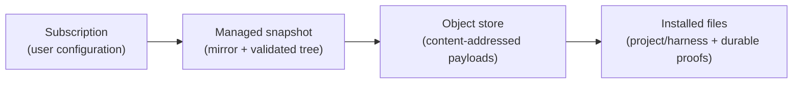

# Design: source subscription lifecycle

Status: proposed.

Input: a dead end reproduced on a real consumer configuration on 2026-08-13, after both registries
were republished under the `2.0.0` contract. The evidence is in §2. This is a product design, not a
patch: the refusals that produced the dead end are all correct, and none of them is removed here.

## 1. Decision

A configured source is a **subscription with a lifecycle**, and AART must implement all of it. Today
it implements half: an operator can subscribe (`source add`) and refresh (`source sync`), but cannot
unsubscribe or re-subscribe. Every situation where the upstream legitimately changes its declared
identity is therefore terminal — the operator's only exit is to hand-edit user configuration and
delete a directory out of AART's own data root.

Two reviewed operations are added:

- **`source remove`** — unsubscribe one alias. Configuration entry, managed snapshot, and the
  `default_registry` pointer if it named that alias.
- **`source resubscribe`** — adopt a changed declared identity at an unchanged origin and ref,
  keeping the alias, kind, ref, and default flag.

The identity refusal itself stays exactly as it is. AART never guesses between colliding source
identities, and adoption never becomes implicit. What changes is that the refusal names an operation
that exists.

## 2. What the evidence says

Registry B was rebuilt during the live acceptance run and its declared `source_id` changed from
`community-skills-registry` to `la-registry-b` at an unchanged origin and ref. A consumer holding a
snapshot from before that rebuild has a source that is stale, incompatible with the current
executable, and unreachable by every configured route:

| Attempt | Result today |
|---|---|
| `aart source sync` | `error: resolved source changed its declared source identity` |
| `aart source add`, same alias | `error: source alias is already configured: registry` |
| `aart source add`, new alias, same origin and ref | `error: source origin and ref are already configured as registry` |
| `aart source remove` | the command does not exist |
| TUI Sources → disable | disables reads; frees neither the alias nor the origin |

Two further facts shaped the design:

- **Removing the configuration entry is not enough.** The identity check compares against the
  managed snapshot store, which is keyed by origin, not by alias. After editing `config.json` by
  hand, `source add` still failed with the same identity error until
  `sources/<origin-key>/` was deleted as well. Any operation that ends a subscription must own both
  places, or it reproduces this dead end one level down.
- **The existing remediation text names an operation that does not exist.** `sync` advises the
  operator to "review the configured origin before replacing this source", and there is no replace.

## 3. Model

Three things are distinct, and the distinction is the reason this change is small:

| Operation | User configuration | Managed snapshot | Object store | Installed files |
|---|---|---|---|---|
| `source add` | writes one entry | publishes | may materialize | never |
| `source sync` | never | republishes | may materialize | never |
| `source resubscribe` | never | republishes under a new identity | may materialize | never |
| `source remove` | deletes one entry | invalidates | never | never |
| `marketplace *` | never | reads | reads/writes | writes after review |

**No source operation ever writes a file inside a project.** Installed artifacts change only through
the marketplace lifecycle, which is separately reviewed. This is what makes `remove` safe to offer:
unsubscribing cannot silently delete a skill out of someone's repository.

## 4. `source remove`

Unsubscribes exactly one alias.

- Deletes that source's configuration entry, and clears `default_registry` when it named the removed
  alias. It never re-points the default at some other source.
- Invalidates the managed snapshot for that origin, unless another configured alias still subscribes
  to the same origin and ref.
- Leaves the object store alone. Objects are content-addressed and referenced by installations that
  this operation does not touch; reclaiming them is a separate reviewed decision.

Review-first, like every other mutation: without `--yes` it prints the alias, kind, origin, ref,
resolved revision, snapshot digest, and what AART can see in user-scope state — and states plainly
that installation manifests inside other project directories are **not** visible to it, so the
listing is what AART knows, not a guarantee. `--yes` applies exactly the reviewed plan.

It does not refuse when installed artifacts exist. Refusing would promise a completeness AART cannot
deliver from user-scope state alone, and the operation destroys no installed file either way. A
project left pointing at a removed alias reports an unconfigured source through the normal
reconciliation path, which is a legible state with a named remedy.

**Which commands stay answerable afterwards, including when the removed alias was the only one.**
`uninstall` and `status` read what the project already has: one removes what the manifest records,
the other reports it, and neither fetches anything. They therefore do not require an enabled source,
and removing the last subscription leaves both working. Every other lifecycle action does require
one and keeps refusing. `2.2.0` took this decision for `uninstall` and left `status` refusing with
`no-source-configured` — a message about the configuration in answer to a question about the
project, and the residue recorded as `RS-07`. The paragraph above already promised the opposite
behaviour; this states plainly which commands deliver it.

## 5. `source resubscribe`

Adopts a changed declared identity at an unchanged origin and ref, under the same alias.

- Keeps alias, kind, location, ref, and the default-registry flag. This is the whole point: the
  remove-then-add route loses all five and orphans every project manifest naming the alias.
- Review shows both identities, both resolved revisions, and both snapshot digests, so the operator
  approves a specific transition rather than "whatever is upstream now".
- Refuses when the declared identity did **not** change, naming `source sync`. One operation, one
  meaning; adoption is never a silent alias for refresh.
- Publishes the new snapshot on `--yes` and rebinds the alias to it. Installed artifacts are
  untouched and surface as `update-available` or `removed-upstream` under the normal reconciliation.

## 6. Diagnostics

Every refusal in this area must name a command that exists. The dead end was as much a diagnostics
failure as a missing-operation failure.

| Refusal | Remediation named |
|---|---|
| `sync`: declared identity changed | `aart source resubscribe --alias X` after reviewing both identities |
| `add`: alias already configured | `aart source resubscribe --alias X`, or `aart source remove --alias X` |
| `add`: origin and ref already configured | the alias that holds them, plus the same two commands |

## 7. One request for both front-ends

Both operations are values in the same application layer that flag mode and the TUI already share,
and the Sources stage gains **Remove source** and **Resubscribe** actions that dispatch that same
request. The TUI does not grow a second implementation of either operation, and neither front-end
can reach an effect the other cannot review. This is the WP-3 exit criterion applied to new surface
rather than to surface being deleted.

`SourceOperationKind` today covers only enable/disable/default toggles, and `SourceManagementRequest`
deliberately rejects any change to the configured set. Removal is a different trust boundary, so it
follows `SourceAdditionRequest`: its own immutable request value, its own review rendering, and its
own confirmation.

## 8. Non-goals

- No automatic identity adoption, and no flag that skips the review.
- No cascading uninstall driven by a source operation.
- No object-store reclamation in this change.
- No new configuration schema revision: removal deletes an entry from the existing shape.
- Source identity adoption remains separate from freshness policy. Effective `sync.mode` is now
  consumed by the origin-freshness runtime described in
  [`DESIGN-source-origin-freshness.md`](DESIGN-source-origin-freshness.md); it never authorizes an
  identity transition.

## 9. Acceptance criteria

1. A source whose upstream changed its declared identity is adopted in one reviewed operation, with
   alias, kind, ref, and default flag preserved.
2. `remove` leaves neither a configuration entry nor a managed snapshot for that origin, and a
   subsequent `add` of the same origin succeeds without any manual filesystem step.
3. No source operation modifies any file beneath a project directory, proved by test rather than by
   inspection.
4. Every alias, origin, and identity refusal names a command that exists in the running executable.
5. The TUI action and the flag-mode invocation dispatch the same application request value for both
   operations.
6. The 2026-08-13 reproduction in §2 is resolved end-to-end without hand-editing configuration or
   deleting a directory from the data root.
