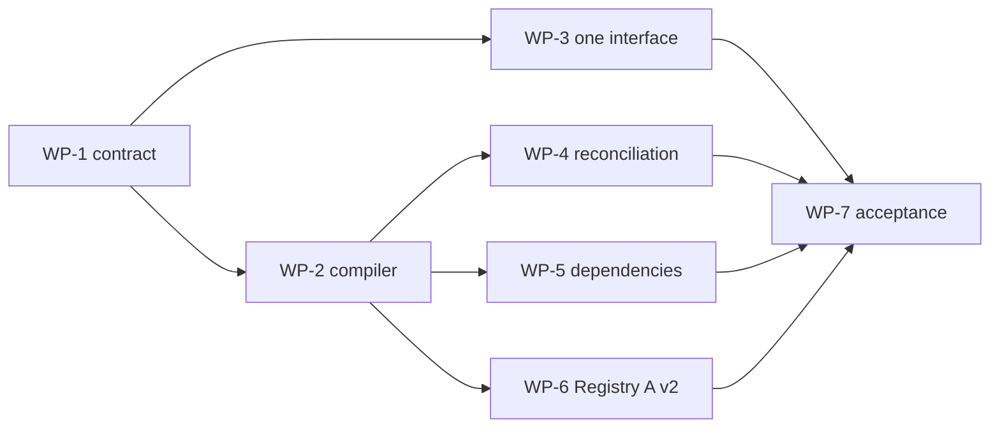

# Plan: canonical remediation after live acceptance

Status: accepted — implementation in progress under
[the design](../design/DESIGN-post-live-acceptance-remediation.md).

The work is sequenced by contracts, not by individual findings. Every work package ends with
stdlib/unittest coverage and a clean `git diff --check` in its repository.

## Guardrails

- Preserve no legacy runtime path, parser, fixture, command, or active documentation. Reject a
  retired protocol at the boundary; do not translate it.
- Do not use credentials. The human-only MCP pass comes after every credential-free gate is green.
- Do not publish either registry until the AART implementation is released or otherwise pinned by
  an explicit, reviewed test build.
- Keep the live-acceptance record append-only. This plan creates a new remediation run rather than
  overwriting observations from the first run.

## WP-1 — freeze the canonical contract

**Repository:** `M1F1/agent-artifacts`

1. Inventory public parser leaves, imports, active docs, fixture trees, and TUI actions that belong
   to legacy catalog/0.1 or setup v1.
2. Define current protocol-family constants and the pure package/dependency result values.
3. Update active design/spec/CLI documentation to name the one canonical interface and the retired
   surfaces.
4. Add negative tests proving retired input is rejected at parsing/loading boundaries, not silently
   adapted.

**Exit:** the compiler and public interface have one agreed input vocabulary; this does not yet
delete code.

## WP-2 — build the current-package compiler

**Repository:** `M1F1/agent-artifacts`

1. Extract package-tree validation into a pure compiler returning `CompiledArtifact` plus typed
   diagnostics.
2. Move setup v2 recipe and package-root `SETUP.md` validation into that compiler; permit the root
   manual in the canonical package allowlist.
3. Validate primary payload semantics, licence/provenance policy, setup declaration, and declared
   dependencies in the same pass.
4. Make registry validate/lock/build/audit, source snapshots, object materialization, security
   inputs, install planning, and setup planning consume the compiled result.
5. Reject setup-invalid artifacts before any install effect is planned or applied.

**Tests:** a v2 setup package passes each boundary; v1 fails each boundary; a package cannot be
published-but-uninstallable; empty hook fails before publication; canonical object export is
CLI-reachable for security scan.

**Exit:** one package acceptance decision is reused end-to-end.

## WP-3 — remove the legacy product surface

**Repository:** `M1F1/agent-artifacts`

1. Remove legacy catalog loaders, `upstream` commands, legacy top-level consumer lifecycle verbs,
   their TUI menu/actions, compatibility adapters, and associated active tests/docs.
2. Add canonical flag-mode commands for every legitimate native-maintainer operation formerly only
   reachable through TUI promotion/import.
3. Simplify workspace classification to explicit canonical markers and neutral onboarding; remove
   invisible legacy fallback branches.
4. Ensure errors guide operators only to canonical commands.

**Tests:** parser inventory contains only the canonical leaves; a canonical workspace never accepts
a legacy writer; empty Git project is not classified as a registry; all human/text TUI paths dispatch
the same application request as flag mode.

**Exit:** there is one CLI, one TUI role model, and one canonical artifact layout.

## WP-4 — reconcile lifecycle through a single plan

**Repository:** `M1F1/agent-artifacts`

1. Implement pure `ReconciliationPlan` and terminal-state values from installation proofs and a
   validated locally cached snapshot.
2. Refactor marketplace status/check/update/prune/uninstall to consume it; bare update selects all
   installations in the requested scope/profile.
3. Define prune as reviewed desired-state reconciliation and make upstream removal an explicit
   terminal item, never an ignored entry.
4. Stabilize review digest inputs; revalidate the exact plan before finalization.
5. Make transaction cleanup remove empty AART-owned state and destination directories only after the
   durable manifest/reference decision.
6. Derive outcome fields from durable commit state and wrap every command failure in the standard
   text/JSON diagnostic envelope.

**Tests:** local drift, upstream update, upstream deletion, warm/cold offline snapshot, bare update,
prune, unchanged symlink, failed finalization, review-digest stability, JSON errors, and clean
uninstall. Include a test that `--json` changes no effects.

**Exit:** lifecycle state is complete, one-directional reconciliation is gone, and reports cannot
contradict the transaction.

## WP-5 — add dependency closure

**Repositories:** `M1F1/agent-artifacts`, then `M1F1/agent-artifacts-registry-2`

1. Add canonical dependency metadata and parser/compiler validation.
2. Resolve a deterministic dependency closure across install/update/review, preserving qualified
   source identity and version constraints.
3. Make unresolved or conflicting dependencies a typed planning error before effects.
4. Annotate residuality artifacts with their explicit dependency on `using-residues`; regenerate the
   Registry B lock/index/evidence only after the new compiler is available.

**Tests:** direct residual-stage selection brings/requests its kernel; an unsatisfied dependency
fails without mutation; collections and explicit dependencies agree but neither relies on the other.

**Exit:** a runnable artifact cannot be installed without its declared required artifacts.

## WP-6 — migrate and publish Registry A

**Repository:** `M1F1/agent-artifacts-registry`

1. Convert `github-docker`, `github-enterprise-docker`, and `postgres-docker` recipes to setup v2.
2. Move each `SETUP.md` to the package root; preserve digest-pinned image references and secret
   placeholders exactly, never credential values.
3. Add required metadata resolved by the new compiler; run format, strict frozen validate, lock,
   build, audit, compatibility, and security evidence.
4. Review and publish the registry commit only after all gates pass against the released/pinned AART
   build.

**Exit:** each MCP artifact is publishable and setup-reviewable with no side effect.

## WP-7 — consumer and release acceptance

**Repositories:** `M1F1/agent-artifacts-live-acceptance-project`, both registries,
`M1F1/agent-artifacts`

1. Create a new remediation-run design/plan/progress record; do not rewrite the original evidence.
2. Use clean clones of both published registries and a clean consumer project; run the complete
   agent-driven acceptance matrix, including regression proofs for every finding cluster.
3. Run the two human curses passes and the real-home round trip only after the automated lifecycle
   matrix is green.
4. Prepare MCP setup review; a human supplies credentials and runs approve/retry/rollback. Capture
   only redacted status/evidence.
5. Verify repository cleanliness and no credential leakage; then update the holistic skill and README
   from the completed new run.

**Exit:** all criteria in the design hold on published registry content and the consumer project;
the result is not accepted merely because unit tests pass.

## Dependency order

WP-3 can proceed after the contract is frozen. WP-4, WP-5, and Registry A migration must not begin
before the compiler contract is green. Registry publication and all human/credential operations are
last.
