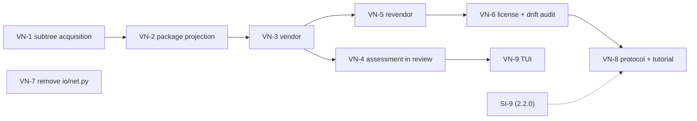

# Plan: registry vendoring

Status: **`VN-1` … `VN-4` landed; `VN-5` … `VN-9` open.** Implements
[the design](../design/DESIGN-registry-vendoring.md). Each landed package records what it found in a
"What the plan did not anticipate" section; those sections, not this line, are the run record.

Target release: **`2.3.0`, contract v11.** Additive — two new registry verbs, two new audit findings,
one removed dead module. No protocol, schema, or on-disk format revision (design §2), so the same
"no registry precondition" property as `2.1.0` and `2.2.0`.

Sequenced by boundary. Every work package ends with stdlib/`unittest` coverage and a clean
`git diff --check`. Run tests with `python3 -m unittest discover -s tests -p "*_test.py"`;
`make quality` gates the branch.

**This plan starts after `2.2.0` ships.** `VN-8` must not land before `SI-9`'s protocol text, because
`SI-9` names vendoring as the supported route for foreign content and would otherwise document a
command that does not exist (design §8).

**`VN-1` … `VN-3` are not glue.** The receiving half of vendoring already exists — the
`provenance.json` format, its index projection, four baseline cross-check rules, the installer's
credential-free-origin check, and a passing end-to-end test at
`tests/canonical_install_planning_test.py:415`. That inventory (design §2, "What exists, and what
this design has to build") makes the shape of the work easy to misjudge in the other direction: none
of the *producing* half exists. Subtree extraction, package projection from foreign bytes, and the
command itself are written from nothing. What the existing half buys is not implementation, it is
scope — no format revision, no consumer change, and `2.0.0` reads the result.

## Guardrails

- **Vendoring never claims safety.** No surface reports a vendored artifact as verified, trusted, or
  safe. The word used is what was found. Design §3.
- **No refusal is loosened.** `vendor` adds a gate — an approved review record — and adds two new
  refusals. It removes none.
- **No credentials, ever.** No token field, flag, or environment variable is added. `VN-7` removes
  the one that exists in dead code.
- **`promote-native` is untouched.** Not one line of its planning path changes; both modes ship side
  by side. If a package needs to change it, the package is wrong.
- **Owned packages stay owned packages.** A vendored artifact must be indistinguishable to a
  `2.0.0` consumer from a hand-authored one, except for carrying `provenance.json` — which that
  consumer already understands.

## VN-1 — a subtree acquisition that fails closed

**Files:** `agent_artifacts/sources/` (subtree extraction beside the existing snapshot path)

1. Extract one `SafeRelativePath` subtree from an acquired immutable `SourceSnapshot`, re-rooting
   entries at the subtree, preserving executable bits, and applying `SnapshotLimits` to the taken
   subtree rather than to the whole repository.
2. Refuse a symlink whose target leaves the subtree, with a diagnostic naming the link and target.
   Neither drop it nor follow it.
3. Refuse an empty result, naming the requested path.
4. Return the subtree's deterministic input digest — the value that becomes
   `OriginProvenance.input_digest`.

**Tests:** a repository with no AART markers yields a subtree; a link escaping the subtree refuses;
`../` and absolute targets refuse; a typo'd path refuses as empty rather than succeeding; executable
bits survive; the same commit and path yield the same input digest twice.

**What the plan did not anticipate:**

- **A contained symlink had to be refused too, and for a different reason.** Item 2 refuses a link
  whose target *leaves* the subtree, which reads as though a link staying inside is carried. It
  cannot be: `tree_digest` knows files and directories only (`EntryKind`), and
  `source_snapshot_digest` refuses any other kind outright, so there is no representation for a
  symlink in the package tree or in the digest that binds it. Carrying one is a format revision,
  which this release explicitly does not make. Both cases refuse, with different messages, because
  reporting an escape that did not happen would send the maintainer looking for the wrong thing.
- **The escape check is relative to the link, not to the subtree root.** A link at
  `lib/up.js` targeting `../../other` escapes while `../index.js` does not; judging both against the
  root would accept the first. It is judged in the subtree's own coordinate space, after re-rooting,
  because that is the tree the maintainer reviews and the one the package will contain.
- **A `--path` naming a file is refused as a path, not as emptiness.** Taking a file's "subtree"
  yields nothing under `path/`, so the empty rule would have covered it with a message about
  emptiness that hides the actual mistake.
- **The origin is required to be immutable Git.** `OriginProvenance` binds a resolved commit and a
  local tree has none, so a local snapshot is refused here rather than at the point where the
  provenance cannot be written.
- **Limits bound the taken subtree, and a test holds the other half of that.** A repository far past
  `max_total_bytes` still yields a small subtree — refusing it for the size of content nobody asked
  for would be the wrong boundary — and depth is measured after re-rooting, so a package taken from
  deep inside a monorepo is shallow.

**Recorded residue, not fixed here:** a repository containing *any* symlink cannot be acquired at
all, so it cannot reach this step. `git.py` accepts only modes `100644`/`100755` and `local.py`
refuses `S_ISLNK` outright, both repository-wide. Foreign repositories — the ones vendoring exists
for — routinely contain symlinks somewhere, so this bounds the feature more than design §5's rule
does. Widening it means teaching the snapshot digest a third entry kind, which is a format change
and belongs to whichever release takes that decision, not to `VN-1`. `VN-3` should state the
limitation in the command's help rather than let it surface as an acquisition error.

**Exit:** design §5. Everything else depends on this.

## VN-2 — projecting a canonical package from foreign bytes

**Files:** `agent_artifacts/registry_maintenance/`

1. Build a `NativeArtifactPackage` from (taken subtree → `payload/`) plus a maintainer-authored
   `artifact.json`: identity, version, summary, payload spec, compatibility, install spec, and
   optional setup reference.
2. Write `provenance.json` — `OriginProvenance(kind="git", url, resolved_commit, path, input_digest)`
   and `ImporterProvenance(id="registry-vendor-v1", version=<AART SemVer>, options_digest)`, where
   `options_digest` covers url, ref, path, and every acquisition option, so two vendorings of one
   upstream state are comparable.
3. Carry acquisition warnings into `Provenance.warnings`, which the baseline already surfaces as
   `importer-warning`.
4. Emit the package into `artifacts/<kind>/<name>/` as ordinary owned registry content.

**Tests:** the projected package loads through `load_native_source` unchanged; the index built from
it carries `IndexProvenance` matching `provenance.json`; the baseline raises no
`provenance-index-mismatch`; `registry validate --strict --frozen` passes.

**What the plan did not anticipate** (`agent_artifacts/registry_maintenance/vendoring.py`,
`tests/registry_vendoring_projection_test.py`):

- **The taken subtree alone almost never makes a loadable payload, so the projection refuses and
  names what is missing.** `_validate_primary_payload` requires `payload/SKILL.md` for a skill and
  `payload/mcp.json` / `payload/hook.json` for an mcp or hook. An upstream repository was never
  shaped for AART, so it contains none of them. That document is the maintainer's wrapper — it is
  authored, and it is reviewed and assessed like any other file they add. Refusing at projection
  time names the document; emitting the package instead would fail later inside `registry validate`,
  against a manifest the maintainer never wrote by hand.
- **`guideline` and `memory` are vendorable only from a single Markdown document.** The loader
  requires exactly one payload file and that it be `.md`, so the projection applies the same rule
  with a message about what the subtree contributed. This is a real narrowing of what "vendor a
  subtree" means for those two kinds, not an implementation detail.
- **`artifact.json` and `provenance.json` are refused as authored input by name.** They are the two
  documents the projection derives from its inputs; a maintainer passing one is trying to override
  the evidence. Refusing them as "not canonical package content" would have been wrong — they are
  canonical — so they refuse with their own message.
- **Everything else authored is bounded to the loader's own allowed roots** (`README.md`, `SETUP.md`,
  `payload/`, `setup/`) and may not collide with a taken byte. A silent overwrite would mean the
  maintainer reviews upstream content their registry does not ship.
- **`options_digest` includes the ref, deliberately, even though a ref moves.** A tag and a branch
  that happen to resolve to one commit are two different standing instructions, and `VN-5`'s drift
  check compares instructions rather than only outcomes.
- **`importer_version` is passed in, not read from `runtime_contract`.** The projection stays a pure
  function of its inputs; the caller (`VN-3`) supplies `EXECUTABLE_VERSION`.
- **`validate --strict --frozen` is not reachable on its own.** It sets `require_compiled`, so the
  test must run `lock --yes` and `build --yes` first, and every registry mutation refuses without a
  writable local Git checkout — the test `git init`s a temporary registry. It builds a fresh registry
  rather than adding the vendored package to the `registry-v1` fixture, whose `entries/mcp/` native
  reference would have to be acquired during `lock`. `VN-3`'s tests inherit all of this.

**Exit:** design §2. Depends on `VN-1`.

## VN-3 — `registry vendor`, review-first

**Files:** `agent_artifacts/cli.py`, `agent_artifacts/commands/registry.py`,
`agent_artifacts/curation/`

1. `registry vendor <kind> <name> --url --ref --path --version [--summary] [--profile] [--platform]
   [--setup-recipe] [--yes] [--json]`, following the review/finalize contract every other registry
   mutation uses.
2. Review states: origin and resolved commit, taken subtree and file count, target path, declared
   version, and the license finding from `VN-6`.
3. Finalize requires an approved review record, exactly as `plan_native_promotion` already requires
   (`registry_maintenance/planning.py:643`).
4. Add `CurationAction.VENDOR` beside `PROMOTE_NATIVE`, so the curation runtime and its review digest
   cover the new action.

**Tests:** without `--yes` nothing is written and no snapshot is published; `--yes` without an
approved review refuses; the emitted registry passes `validate`/`lock`/`build`/`audit`; an upstream
with no AART markers succeeds where `promote-native` refuses — the same fixture proving both.

**What the plan did not anticipate** (`registry_commands/planning.py:plan_artifact_vendor`,
`curation/runtime.py:_prepare_vendor`, `tests/registry_vendor_command_test.py`):

- **`vendor` is a workspace operation, not a registry mutation, despite reading as
  `promote-native`'s sibling.** `RegistryMutationPlan` allows exactly three path shapes —
  `aart.lock.json`, `aart.index.json`, and `entries/<kind>/<name>.json` — so it cannot carry payload
  bytes under `artifacts/`, nor an executable bit. The vendor plan is a `RegistryWorkspacePlan` with
  a new `RegistryOperation.VENDOR`, the same machinery `scaffold` uses. It follows that a vendor
  leaves the lock and index stale, so `CurationAction.VENDOR` joins `INIT`/`SCAFFOLD` in
  `_follow_up`: the review points at `lock` and `build` before `validate --strict`, which would
  otherwise fail and send the maintainer looking for a fault in the copy.
- **No flag can carry file bytes, so `vendor` adopts what the maintainer has already authored at the
  target path.** `VN-2` refuses a projection whose payload lacks the kind's required document, and a
  foreign subtree essentially never contains it. Everything already present under
  `artifacts/<kind>/<name>/` except `artifact.json` and `provenance.json` is adopted as authored
  content and projected with the taken bytes, where `VN-2`'s collision and canonical-root refusals
  judge it. A vendor over an existing `artifact.json` refuses, so adoption can never overwrite a
  package. The same mechanism is what makes `--setup-recipe` usable: the recipe and its `SETUP.md`
  are authored beside the payload, and the plan refuses when a declared recipe is not present.
- **The approved review record gates the plan and is not persisted.** `plan_native_promotion` stores
  its record in the `entries/` document it writes; an owned package has none, and
  `index_artifact_from_package` projects `review=None` for owned content. So the gate is real at
  plan time and invisible afterwards — the baseline reports `review-missing` for a vendored
  artifact. **Recorded residue, owned by `VN-4`:** that package already has to persist the
  assessment with the artifact, and the review decision belongs in the same place.
- **The review's origin statement is a `CurationCheck` named `vendor-origin`.** `CurationReview`
  carries changes, checks, and warnings, and only those are covered by the review digest — there is
  no free-text field to state origin, ref, resolved commit, subtree, target, declared version, and
  payload file count. Putting them in a check means the maintainer approves a digest that includes
  them. The license finding is absent from those details until `VN-6`.
- **`--version` is spelled `--artifact-version`,** matching `scaffold`. Design §4 requires that the
  maintainer supply the version, not that the flag be spelled `--version`, which at that parser
  level would read as the executable's own version flag.
- **Two warnings, not one.** Besides design §3's "not a safety claim", the review states that this
  registry now owns the copy and that upstream fixes reach consumers only when it is vendored again
  — the consequence a maintainer is most likely to discover later.
- **A new registry verb fails `tests/registry_cli_test.py` until it is listed there.** That test
  asserts the registry subparser's action set exactly, which is the guard that a verb cannot be
  added without a command boundary; it had to be extended, not worked around.

**Recorded residue, not fixed here:** `vendor` is create-only — a second vendor of the same identity
refuses with `artifact package already exists`, and that message does not name the command that does
adopt upstream movement, because `SI-6` requires every command AART names to be one the executable
accepts. When `VN-5` lands `revendor`, that refusal should name it.

**Exit:** design §1 and §8. Depends on `VN-2`.

## VN-4 — the assessment is part of the review

**Files:** `agent_artifacts/commands/registry.py`, `agent_artifacts/security/`

1. Run `assess_installation_risk` over the projected package's immutable object during the vendor
   review and render the findings inline, in text and JSON.
2. Render the framing verbatim from the `security` command: assessments reduce uncertainty; they are
   not safety guarantees. No surface says verified, trusted, or safe.
3. Persist the assessment with the artifact so a second reviewer sees what the first saw.

**Tests:** a planted `curl … | sh` in the authored `install.sh` appears as
`shell-pipe-to-interpreter` — proving the maintainer's own wrapper is assessed, not only the payload;
a committed credential in the upstream subtree appears as `embedded-credential`; an unpinned install
appears as `unpinned-package-install`; the rendered review contains no word claiming safety.

**What the plan did not anticipate**

- **The assessment cannot live in `provenance.json`.** The obvious home is circular: the assessment
  names the object digest of the package, and `provenance.json` is one of the package's files, so
  writing the assessment into it changes the digest the assessment describes. The evidence is
  therefore written as its own canonical document at `security/attestations/<attestation-digest>.json`
  — the exact path `SecurityIndexEntry` already requires — with `AttestationOriginKind.LOCAL`,
  because this ran on the maintainer's machine and a `registry-ci` origin would have to name a
  resolved registry revision that does not exist until the vendoring is committed.
- **It is deliberately not written into `security/index.json`.** That index binds the compiled
  `registry_inputs_digest`, which does not exist until `build` runs, and `registry audit` demands
  evidence coverage for *every* compiled object once an index is present — so writing one here would
  make audit fail for any registry that already has other artifacts, breaking design acceptance 4. A
  loose attestation document is additive: `security/` is excluded from `registry_inputs_digest`, so
  committed evidence cannot make the lock or index read as stale. A test holds that.
- **`FilesystemRegistryWorkspace` could not see `security/` at all.** Its managed roots were
  `entries`, `artifacts`, `collections`. A plan writing an attestation therefore failed apply
  *verification* — the file was written and the re-read snapshot did not contain it. Adding
  `security` to the reader's roots (and to `_managed_path`) fixes a second, pre-existing defect in
  passing: `audit_registry_workspace` reads `security/index.json` out of that same snapshot, so
  until now its security-evidence branch was unreachable from `registry audit` on a real checkout.
- **A finding does not refuse the vendor.** The `vendor-assessment` check passes when the assessment
  *ran to completion*, not when it found nothing: an assessment that completed and reported a
  critical credential has done its job, and design §3 gives the decision to the maintainer. Refusing
  here would have converted evidence into a policy AART does not own.
- **VN-3's own wording had to change.** Its warning said "a clean vendor reports what was found";
  with an assessment in the review that reads as a verdict, so it now says "a successful vendor
  reports what was copied". The test asserts no `safe|verified|trusted|secure|vetted` token appears
  in either rendering.
- **The maintainer's wrapper is assessed because it is part of the object, not by a special case.**
  The test authors a declared custom setup entrypoint (`setup/installer.json` +
  `setup/install.sh`), which the loader requires to be executable and to carry the manual-setup
  header — an unexpected gate that is correct: an entrypoint no one can find from `SETUP.md` is
  exactly what should not be adopted silently.

**Exit:** design §3. Depends on `VN-3`.

## VN-5 — `registry revendor` and three honest dispositions

**Files:** `agent_artifacts/registry_maintenance/`, `agent_artifacts/commands/registry.py`

1. Re-resolve the recorded `origin.url` at the recorded ref, take the recorded subtree, and compare
   its input digest with `origin.input_digest`.
2. Report `up-to-date`, `changed`, or `unreachable`, reusing the disposition shape of
   `check_native_reference`. Never report `unreachable` as `up-to-date`.
3. On `changed`, render the file-level diff and refuse to finalize without an explicit `--version`.
4. On `up-to-date`, finalize is a no-op that says so.

**Tests:** an unmoved upstream is `up-to-date`; a moved one is `changed` with the correct
added/changed/removed counts and refuses without `--version`; an unreachable origin is `unreachable`
and mutates nothing; a re-vendor at the recorded commit reproduces `origin.input_digest` exactly
(design acceptance 11).

**Exit:** design §4 and §6. Depends on `VN-3`.

## VN-6 — license capture, and drift visible from CI

**Files:** `agent_artifacts/registry_maintenance/`, `registry audit`

1. Discover a license file in the taken subtree; pre-fill `ArtifactManifest.license` when
   unambiguous; report what was found — or that nothing was — in the vendor review.
2. `registry audit` reports a vendored artifact with no recorded license.
3. `registry audit` reports vendored artifacts behind upstream, read-only, with unreachable origins
   reported as unknown rather than as drift.
4. Neither finding fails the audit on its own.

**Tests:** a subtree with `LICENSE` pre-fills and reports it; two license files report ambiguity and
pre-fill nothing; audit lists the unlicensed vendored artifact and still exits successfully; audit
distinguishes behind-upstream from unreachable.

**Exit:** design §6 and §7. Depends on `VN-5`.

## VN-7 — delete the token module that promises what AART does not do

**Files:** `agent_artifacts/io/net.py`, `tests/net_test.py`, `docs/design/`

1. Delete `agent_artifacts/io/net.py` and its test. It is imported by nothing else, and it is the
   only place in the package naming `GITHUB_TOKEN` or `GITHUB_API_URL` — including a hint telling a
   reader to set them for GitHub Enterprise, which does nothing.
2. Add a guard asserting no module in `agent_artifacts/` mentions either name, so the promise cannot
   reappear.
3. Mark `DESIGN-upstream-import.md` and `DESIGN-upstream-github-hosts.md` as superseded, pointing at
   this design, and record in the compatibility addendum that AART holds no tokens and reaches
   private hosts through system Git's own configuration.

**Tests:** the guard fails on a planted mention. Independent of every other package.

## VN-8 — the protocol says what a vendored artifact is

**Files:** `docs/protocol/registry-v1.md`, `docs/protocol/native-source-v1.md`,
`agent_artifacts/cli.py` help, tutorials

1. State in the registry protocol that a registry may own, reference, or vendor content, and what
   each means for who the consumer must reach and who owns the version.
2. State the maintainer responsibility in the protocol document, not only in a tutorial: vendoring
   moves the trust boundary into the registry, and a clean vendor is not a safety claim.
3. One line each in `registry --help` distinguishing `vendor`/`revendor` from
   `promote-native`/`refresh-native`.
4. A worked tutorial: vendoring one MCP server from a repository with an arbitrary layout, adding
   `install.sh` and `SETUP.md` as the setup recipe, reading the assessment, and re-vendoring when
   upstream moves.

**Must land after `SI-9`.** Depends on `VN-6`.

## VN-9 — the same action in the text front-end

**Files:** `agent_artifacts/tui.py`, `agent_artifacts/curation/`

1. Add `vendor` and `revendor` to the maintainer action list beside the existing
   `promote-native`/`refresh-native` entries (`tui.py:193`).
2. The TUI path produces the same request value as flag mode, and shows the same assessment.

**Tests:** the TUI request value equals the flag-mode request for one fixture; the rendered review
contains the assessment. Depends on `VN-4`.

## Dependency order

`VN-7` is independent of everything and can land first. `VN-1` gates the rest of the chain. `VN-4`
and `VN-5` are independent of each other once `VN-3` exists. `VN-8` is dashed from `SI-9` because it
is an ordering constraint across releases, not a code dependency.

## Release shape

**`2.3.0`, contract v11** — `VN-1` through `VN-9`. Two new registry verbs, two new audit findings,
one dead module removed. No protocol, schema, or format revision: a vendored artifact is an owned
package carrying `provenance.json`, which every AART from `2.0.0` already reads.

The honest paragraph for the release notes: vendoring puts foreign bytes in your registry and makes
your registry their distributor. It removes the requirement that upstream speak AART, and it removes
the requirement that consumers reach upstream at all. What it does not remove is the maintainer's
responsibility for what they copied — and the release notes should say that in those words.
