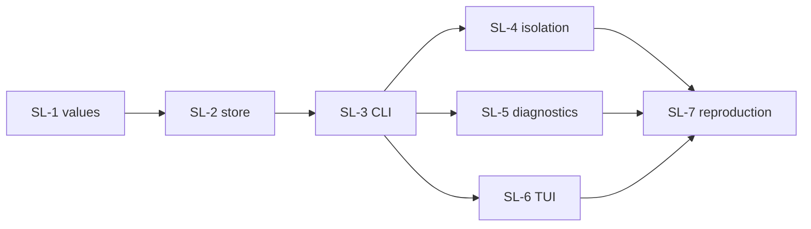

# Plan: source subscription lifecycle

Status: proposed — implements
[the design](../design/DESIGN-source-subscription-lifecycle.md).

Sequenced by boundary, not by front-end. Every work package ends with stdlib/`unittest` coverage and
a clean `git diff --check`. Run tests with
`python3 -m unittest discover -s tests -p "*_test.py"`; `make quality` gates the branch.

## Guardrails

- No refusal in `application/sources.py` is loosened. The identity comparison stays; only the exit
  from it is new.
- No source operation may write beneath a project directory. SL-4 makes this a test, not a promise.
- Review-first everywhere: without `--yes` each new command changes nothing, and `--yes` finalizes
  the digest of the plan computed in the same process.
- The TUI never gains its own implementation of either operation.

## SL-1 — subscription lifecycle values

**Files:** `agent_artifacts/sources/model.py`, `agent_artifacts/application/sources.py`

1. Add the pure request/outcome values for unsubscribe and identity adoption, alongside
   `SourceSyncRequest`/`SourceSyncOutcome`.
2. Give adoption an explicit expected-identity transition, so a plan can be revalidated before it is
   finalized and cannot silently absorb a second change that arrived in between.
3. Model snapshot invalidation as a declared effect of unsubscribe, including the "another alias
   still subscribes to this origin and ref" case.

**Tests:** adoption refuses an unchanged identity; adoption refuses a transition other than the
reviewed one; unsubscribe keeps the snapshot when a second alias shares the origin.

**Exit:** both operations exist as inert values with complete diagnostics.

## SL-2 — snapshot store ownership

**Files:** `agent_artifacts/sources/runtime.py`, snapshot store paths/publication

1. Implement snapshot invalidation for one origin under the same lock discipline `sync` uses.
2. Make adoption publish the new snapshot atomically, replacing the identity binding rather than
   appending beside it.
3. Prove the store is left with no residue that a later `add` would trip over — the second trap in
   design §2.

**Tests:** after unsubscribe, adding the same origin succeeds in the same process; an interrupted
invalidation leaves either the complete old snapshot or none, never a half-deleted tree.

**Exit:** configuration and snapshot store cannot disagree about who is subscribed.

## SL-3 — `aart source remove` and `aart source resubscribe`

**Files:** `agent_artifacts/cli.py`, `agent_artifacts/commands/source.py`

1. Add both subcommands with `--alias`, `--yes`, and `--json`, following the existing review/finalize
   contract.
2. Render the review described in design §4 and §5, including the explicit statement that project
   manifests outside the current process are invisible to AART.
3. Emit the standard typed diagnostic envelope for every failure, in text and JSON alike.

**Tests:** without `--yes` neither command changes configuration or store; `--json` changes no
effect; removing an unknown alias is a typed error naming `source list`.

**Exit:** an operator can complete the whole lifecycle from flag mode.

## SL-4 — project isolation proof

**Files:** `tests/`

1. Run every source operation with a project directory present and installed artifacts in it.
2. Assert byte-identical project trees and durable manifests before and after.

**Exit:** design §3's central claim is enforced by test.

## SL-5 — diagnostics that name existing commands

**Files:** `agent_artifacts/application/sources.py`, `agent_artifacts/tui_sources.py`

1. Replace the "before replacing this source" remediation with the mapping in design §6.
2. Do the same for the alias-already-configured and origin-already-configured refusals.

**Tests:** each of the three refusals names a command the CLI parser accepts — asserted against the
parser, so the text cannot drift away from the shipped surface.

**Exit:** no refusal in this area is a dead end.

## SL-6 — TUI Sources actions

**Files:** `agent_artifacts/tui_sources.py`, `agent_artifacts/tui.py`

1. Add **Remove source** and **Resubscribe** to the Sources stage as their own reviewed request
   values, following `SourceAdditionRequest` rather than the toggle-only management request.
2. Render the same review content as flag mode, and require an explicit Finalize.

**Tests:** the TUI path and the flag-mode path produce the same application request value for the
same inputs; cancelling at review leaves configuration and store untouched.

**Exit:** one role model, two front-ends, one request.

## SL-7 — reproduction closes

**Files:** `tests/`, `docs/testing/PROGRESS-live-acceptance.md`

1. Reconstruct design §2 as a test: a published snapshot, an upstream that changes its declared
   identity at the same origin and ref, and an operator who recovers using only shipped commands.
2. Record the residue and its resolution in the live-acceptance ledger.

**Exit:** design §9 criterion 6 holds.

## Dependency order

SL-1 and SL-2 are the contract; nothing user-facing lands before they are green. SL-4, SL-5, and
SL-6 are independent of each other and can run in parallel once the commands exist.
