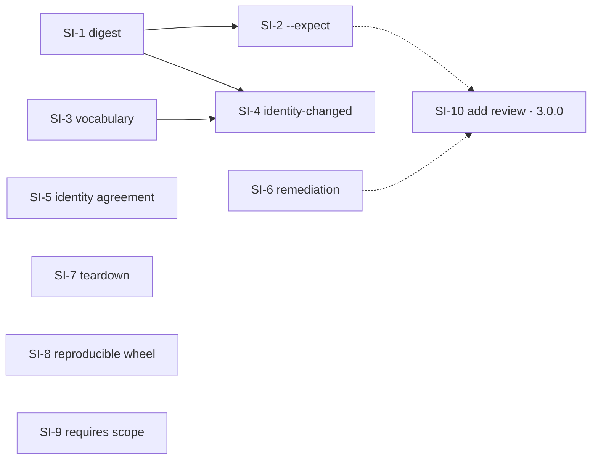

# Plan: subscription identity binding

Status: **not started.** Implements
[the design](../design/DESIGN-subscription-identity-binding.md), which composes the response to
[live acceptance v2](../testing/PROGRESS-live-acceptance-v2.md).

SI-1..SI-9 are the `2.2.0` release; SI-10 is a breaking change to `source add` and is gated on
`3.0.0` (design §7.3).

Sequenced by boundary, not by finding. Every work package ends with stdlib/`unittest` coverage and a
clean `git diff --check`. Run tests with `python3 -m unittest discover -s tests -p "*_test.py"`;
`make quality` gates the branch.

## Guardrails

- **No refusal is loosened.** Three of these packages add a second gate; none removes one.
- **No source operation writes beneath a project.** `tests/source_project_isolation_test.py` is not
  modified by this work. If a package needs it changed, the package is wrong.
- **No protocol, schema, or on-disk format changes.** `identity-changed` is computed, never stored;
  `2.0.0` ↔ `2.1.x` data-root interoperability stays true and gets a test.
- **Review-first everywhere it already is.** `--expect` is additive; `--yes` alone keeps its meaning.

## SI-1 — the plan digest stops being a clock

**Files:** `agent_artifacts/installation/model.py`

1. Remove `source_age_seconds` from `_plan_review_value`. Keep the field on `InstallPlan` and keep it
   in the rendered review — freshness is information for the operator, not identity of the plan.
2. Audit the remaining inputs for anything else derived from wall-clock or from process state.

**Tests:** two reviews of one plan built from identical inputs at different simulated times produce
one digest; a real end-to-end double review, seconds apart, agrees.

**Exit:** design §5's first half. This lands first because every other package's tests become
deterministic once it does.

## SI-2 — `--expect`, a reviewed decision that survives a second command

**Files:** `agent_artifacts/cli.py`, `agent_artifacts/commands/marketplace.py`,
`agent_artifacts/commands/source.py`, consumer and source application layers

1. Add `--expect <digest>` to every review-first consumer command; finalize only when the recomputed
   review digest matches, otherwise refuse and render the new review.
2. Add `--expect <from>:<to>` to `source resubscribe`, passing the parsed pair as the existing
   `SourceIdentityTransition` expectation — the value already carries both sides for this purpose.
3. State the refusal in one typed diagnostic naming what changed.

**Tests:** finalize with a stale `--expect` refuses and mutates nothing; with a current one it
finalizes; `resubscribe --expect` refuses an origin that moved after the review; `--yes` without
`--expect` is unchanged.

**Exit:** design §5. Depends on SI-1 — without it, `--expect` would be unusable by construction.

## SI-3 — resolution failure names the layer that failed

**Files:** `agent_artifacts/consumer/`, `agent_artifacts/application/`, diagnostics

1. Split today's `artifact-not-found` into the four cases in design §3, each with its own
   remediation.
2. Remove source resolution from the uninstall path: uninstall plans from the manifest alone.
3. Keep `artifact-not-found` for the one case where it is true.

**Tests:** uninstall succeeds after `source remove` and leaves the project exactly as an ordinary
uninstall does; each of the four causes produces its own code; the cold-cache offline case reports
`source-not-synchronized` (closes v1 `LAF-19`).

**Two things found while building it, both recorded rather than assumed:**

- Resolution was not the only gate. `no-source-configured` fires in `load_configuration` *before*
  any resolution, so removing the last subscription refused uninstall even once the manifest could
  plan it. Uninstall now loads its service with `content_required=False`. This is the one refusal
  the release loosens, and only for uninstall, because uninstall is not a content operation — it
  reads what the project already has. Every other lifecycle action keeps the contract.
- Collections still resolve through the catalog on uninstall. A collection is a registry-side
  grouping the manifest never records, so there is nothing to expand it from. Naming the members
  works after the source is gone; naming the collection does not.

**Known gap, deliberately not closed here:** the TUI builds its uninstall list from catalog rows, so
an installed artifact whose source was removed is absent from that list rather than misreported. It
fails closed, and the row source is what `SI-4` revisits when it teaches both renderers a new
reconciliation status.

**Exit:** design §3 and attractor A1.

## SI-4 — `identity-changed` reconciliation

**Files:** `agent_artifacts/consumer/` reconciliation and rendering,
`agent_artifacts/installation/model.py`

1. Resolve installation records through the subscription (alias, origin, ref); compare recorded
   `declared_id` against the subscription's current identity.
2. Add `identity-changed` as a reconciliation status beside `update-available` and
   `removed-upstream`, in both renderers.
3. Make `marketplace update` act on it: the review states both identities, and finalize rebinds the
   record.

**Tests:** install, adopt a new identity with `source resubscribe`, then in the project — `status`
reports `identity-changed`, review states both identities and changes nothing, `--yes` rebinds and
the next `status` is `current`; nothing under the project changed during the `resubscribe` itself.

**What the plan did not anticipate:**

- **The review needed a new field, and it belongs in the digest.** "The review states both
  identities" cannot be rendered from a `ConsumerReviewItem`, which carries no source identity at
  all. `identity_transition` (`<installed-under>:<now-declared>`, `None` otherwise) is now a field on
  the item and a member of `_review_value`. That is the opposite of SI-1's decision about freshness,
  and deliberately so: freshness is a clock reading, a rebinding is a property of the plan. Inside
  the digest, `--expect` protects it — consent read for a rebinding to `B` cannot apply a rebinding
  to `C`. Additive to the review payload; `schema_version` stays 1.
- **Finalize's prune precondition keeps the identity comparison.** Splitting
  `_recorded_source_current` would otherwise have loosened it. A prune is reviewed as "the source
  under identity X no longer publishes this artifact", so an identity change between Review and
  Finalize invalidates that evidence exactly as a vanished subscription does. The call site now
  spells out both halves.
- **The resubscription review's note was the thing `LAF-33` falsified**, so it is rewritten here
  rather than left for SI-6: it now names `identity-changed` and the command that acts on it.

**Recorded residue, not fixed here:** `marketplace status` in a project whose *only* subscription was
removed refuses with `no-source-configured` instead of reporting `source-unavailable` for its
installations. SI-3 exempted uninstall from that gate because design §3 names uninstall; whether
`status` — which is fully local and fetches nothing — is a content operation at all is a decision the
design does not take, and taking it silently inside SI-4 would be wrong. It is visible in
`tests/identity_change_reconciliation_test.py`, which keeps a second subscription alive to work
around it.

**Exit:** design §2 and the criticality finding `LAF-33`. Depends on SI-3 for the vocabulary.

## SI-5 — the consumer checks the identity agreement

**Files:** source snapshot compilation

1. When a snapshot carries both `aart-registry.json` and `aart-source.json`, refuse a `registry_id` /
   `source_id` disagreement at acquisition.
2. One typed diagnostic naming both values and both files.

**Tests:** a fixture registry with disagreeing identities is refused by `source sync` and by
`source add`; a registry carrying only `aart-source.json` is unaffected.

**What the plan did not anticipate:**

- **Half the check already existed, on the path that did not need it.** `validate_registry_source_candidate`
  compared the two identities for `SourceKind.REGISTRY_GIT` only, with the message
  "registry and source identities differ" — naming neither value nor either file. The gap was the
  direct/local path, which is how `LAF-37` was reproduced. Both paths now share one comparison and
  one diagnostic.
- **Presence is judged on parseability, not on the filename.** A snapshot has an agreement to check
  only when both markers are regular files that each parse as their own protocol document. A source
  publishing `aart-source.json` alone is not a registry; that case is explicitly covered by a test,
  because a check that turned every native source into a registry would be the wrong fix.

**Recorded residue, not fixed here:** a snapshot carrying a *malformed* `aart-registry.json` skips
this check, because there is no `registry_id` to compare against. On the registry path the workspace
validation refuses first, so the gap is confined to a direct/local subscription to something shaped
like a registry. Closing it means adding a new refusal — "a root `aart-registry.json` must parse" —
which is broader than design §2 authorizes, and worth taking as its own decision rather than as a
side effect of this package.

**Exit:** design §2's second half, `LAF-37`. Independent of SI-3/SI-4.

## SI-6 — remediation reaches the operator

**Files:** `agent_artifacts/commands/source.py` renderer, `agent_artifacts/tui_sources.py`,
`tests/source_remediation_test.py`, `docs/release/`

1. Render remediation under per-source diagnostics in text mode.
2. Widen the dead-end guard from `Diagnostic.remediation` to every user-visible `aart …` mention in
   the package, and fix what it catches — starting with the `source doctor` reason in
   `tui_sources.py`.
3. Add renderer parity: for a representative refusal per command family, the remediation lines in
   text equal those in JSON.
4. Report lock-holder age and liveness in the stale-lock refusal; give the object-store failure a
   remediation line.
5. Record `source doctor`'s `2.0.0` removal in a compatibility addendum.

**Tests:** the widened guard fails on a planted stale command name; renderer parity holds for every
family; the stale-lock message states the age.

**What the plan did not anticipate:**

- **The widened guard needed a definition of "a command claim", and prose forced it.** The package
  says `aart installs your team's artifacts`; it also writes the managed-block marker
  `# >>> aart setup: <coordinate> >>>` into config files. Neither is an offer to run something. A
  mention counts as a claim on three shapes only: it is backticked, its first word is a command name,
  or it carries a `--flag`. Docstrings are excluded — this file's own explanation of the removals
  would otherwise be a finding about itself — and an f-string is rendered whole with each
  interpolation replaced by `PLACEHOLDER`, because reading only its constant pieces reports
  `aart source sync --alias` as a command missing its value. A choice-constrained flag rejecting
  `PLACEHOLDER` is not a finding: the guard proves the command and its flags exist and cannot prove
  a value computed at run time.
- **Item 5 turned out to be load-bearing for item 2, not documentation beside it.** `aart setup
  retry` reads as prose to any regex, because `setup` names no live command. The guard therefore
  reads the removed command names out of the compatibility tables in `docs/release/`. Recording a
  removal is what makes a mention of it legible; the addendum is wired into the gate.
- **`source doctor` was the smallest thing the widened guard caught.** It also caught
  `aart setup retry` and `aart setup rollback` in `setup.py`, `tui.py` and `setup_runtime.py` — the
  `aart setup` group was renamed in `2.0.0` — `aart source add` offered without its required
  `--kind`, and `aart registry init` offered without `--source-id`/`--display-name` in three places.
  Each was a command an operator could copy and be refused by.
- **One of them has no replacement, and the package refused to invent one.** `aart setup rollback`
  never shipped: `setup_engine.rollback_setup` is reachable only from library code. Exposing the
  verb is a CLI addition and a release-contract change, so the rollback field now names the artifact,
  profile and scope to undo from the recorded receipt and says plainly that no command does it. The
  missing surface is recorded in the addendum and as a residue below.
- **"Every command family" is three families, and the other three say why.** `upgrade` defines no
  `--json`, so it has a single renderer and nothing to compare. `security` and `reporting` report
  through plain messages rather than a diagnostic envelope. `registry` is covered and parity holds,
  but vacuously — see the residue.
- **The object-store remediation is one shared pair, not one line.** Every `store-unavailable`
  failure is the same environment problem stated by a different syscall, so all eleven now route
  through one helper. Writing a distinct remediation per call site would have invented distinctions
  the operator does not have.

**Recorded residues, not fixed here:**

- **No `registry` refusal carries remediation at all.** The family emits next-step lines after a
  successful action, and its refusals carry an empty `remediation` in both renderers. That is not a
  rendering defect — there is nothing to render — and authoring remediation across the registry
  surface is its own package. The parity test covers `registry` today so the gap cannot widen
  silently into a text/JSON divergence.
- **A completed setup cannot be reversed by any command.** Recorded in
  `docs/release/compatibility-v8-addendum.md`. Adding the surface is a CLI addition; this package
  only stopped advertising one that does not exist.

**Exit:** design §4 and attractor A3. Independent of every other package.

## SI-7 — teardown leaves the repository as it found it

**Files:** `agent_artifacts/consumer/` uninstall finalization

1. When the last installation for a scope is removed, remove the emptied manifest, its lock, and any
   profile directories the install created and left empty.
2. Never remove a directory that was not created by an install, and never one that is non-empty.

**Tests:** clean checkout → install → uninstall everything → `git status --porcelain` is empty; a
pre-existing `.claude/skills` with foreign content survives.

**What the plan did not anticipate:**

- **Two lifetimes, not one.** "When the last installation for a scope is removed, remove … any
  profile directories the install created and left empty" reads as one event, and taken literally it
  closes only half of `LAF-17`: the *last* record's uninstall knows its own destinations and nothing
  about the ones earlier uninstalls emptied, so a project holding a skill and a memory artifact
  keeps an empty `.claude/skills` forever — the skill went first, and the memory record cannot name
  it. Directories are therefore reclaimed by every uninstall, for the record it removes; the
  manifest and its lock, which belong to the scope rather than to any record, are reclaimed only
  when the last record leaves. `ScopeTeardown.reclaims_state` is the distinction.
- **The harness root is never reclaimed.** `.claude` is the agent's own directory: it is shared with
  the harness, and no installation record proves an install created it. `.claude/skills` and
  `.tabnine/agent/skills` go, `.claude` and `.tabnine` stay. An empty harness root is invisible to
  Git, so the run's assertion holds either way — this is a refusal to invent evidence, not a
  shortcut.
- **`rmdir` is the "never remove a non-empty directory" guard, not a check in front of one.** A
  stat-then-remove would race a concurrent install; a bare `rmdir` refuses a non-empty directory
  atomically, and refusing is the wanted outcome. The same rule then answered the user scope for
  free: `<data-root>/state` also holds `object-references.json`, so it survives while its manifest
  and lock go. That asymmetry with the project scope is the guard working, and is documented rather
  than special-cased.
- **Teardown cannot fail a proven uninstall.** It runs inside the scope lock, after the effects and
  the replacement state have been applied and read back. Rolling a correct removal back because
  litter could not be cleared would trade a correct result for an incorrect one, so what it cannot
  reclaim is reported in the item's detail instead.
- **The lock file is removed while its own lock is held.** The descriptor outlives the unlink, so
  the exclusion this uninstall holds outlives the path; anything arriving afterwards finds no scope
  and creates one from nothing. The alternative — release, then re-acquire to clean up — opens a
  window in which a concurrent install's fresh manifest could be deleted.
- **The teardown is not in the review digest.** It is a deterministic function of the record, the
  scope roots, and the replacement state, all of which the digest already binds, and it renders
  nothing new to the operator. Adding it would move every uninstall digest without changing what
  `--expect` protects.

**Recorded residue, not fixed here:** the last uninstall of a *merge* effect leaves the merge file
behind — `.mcp.json` reduced to `{"mcpServers": {}}`, `CLAUDE.md` emptied of its managed block. That
file is in the worktree the operator owns and may have been theirs before the install; deciding when
AART may delete it is a different question from reclaiming AART's own directories, and
`tests/canonical_lifecycle_test.py` pins the current behaviour for foreign keys.

**Exit:** v1 `LAF-17`, unresolved across two runs.

## SI-8 — the published wheel is byte-reproducible

**Files:** `scripts/build_wheel.py`, `scripts/release.py`, `docs/release/`

1. Derive every zip entry timestamp from the tagged commit's date instead of build time, and pin the
   archive's member order and compression so nothing else varies with the machine.
2. Publish the expected wheel digest in the release evidence, so a verifier has something to compare
   against without rebuilding twice.

**Tests:** two builds of one commit, at different wall-clock times, produce byte-identical archives —
the assertion the run's `LAF-30` probe failed by hand. A packaging test compares whole-archive
digests, not member contents, so a regression cannot pass by being "content-identical".

**Exit:** design §7.1. Independent of everything else.

## SI-9 — `requires` is intra-registry, and says so

**Files:** `docs/protocol/registry-v1.md`, `agent_artifacts/cli.py` help,
`registry build` dependency diagnostic

1. State the rule in the protocol document: `requires` resolves inside one registry, deliberately,
   because a cross-registry dependency breaks when a maintainer who does not own the artifact changes
   their own registry. Name the two routes that exist **in this release** for depending on foreign
   content: own it here (`registry scaffold`) or reference it here (`registry promote-native`).
   Do not name vendoring — [`PLAN-registry-vendoring.md`](PLAN-registry-vendoring.md) adds it in
   `2.3.0`, and `VN-8` revises this same protocol text once the command exists. Documenting a route
   before it ships is the defect shape this project files against itself.
2. Say the same in one line of `registry` help.
3. Change the build refusal from `skill/x requires missing skill/y` — which reads as "not published
   yet" — to a diagnostic that says the dependency must live in this registry, with remediation
   naming both routes (publish it here, or vendor it).

**Tests:** the refusal's remediation parses, as `SI-6`'s widened guard requires; the diagnostic
distinguishes "absent from this registry" from "present in another configured one" when the second is
knowable.

**Exit:** design §7.2. Independent of everything else.

## SI-10 — `source add` reviews like its siblings · **`3.0.0` only**

**Files:** `agent_artifacts/cli.py`, `agent_artifacts/commands/source.py`,
`agent_artifacts/tui_sources.py`, tutorials, registry CI workflows

**This package must not ship in a minor.** `aart source add …` currently configures the source; after
it, the same invocation would review and exit `0` having configured nothing. Every script, tutorial,
and registry workflow that calls it would silently stop working while still reporting success — the
exact defect shape this project files against itself. It is a breaking change to a public command's
contract, so it lands with the next major, with no deprecation window (design §7.3).

1. Give `add` the same review/finalize contract as `sync`, `resubscribe`, and `remove`: a review that
   states origin, ref, default-registry effect, and what will be fetched; `--yes` to finalize; and
   `--expect` from `SI-2`.
2. Update the tutorials and both registries' CI workflows in the same release.
3. Until then — and this part ships with `2.2.0` — `aart source --help` states which verbs review and
   which mutate immediately.

**Tests:** without `--yes`, `add` writes no configuration and publishes no snapshot; the TUI Add path
produces the same request value as flag mode; a `2.x`-shaped invocation is refused with a diagnostic
naming `--yes` rather than silently reviewing.

**Exit:** design §7.3. Parked until the `3.0.0` branch exists; the help-text half is carried by
`SI-6`.

## Dependency order

SI-1 first: it makes every downstream test deterministic. SI-5 through SI-9 are independent of the
rest and of each other, so they can run in parallel from the start. SI-10 is dashed because it is not
part of this release at all — it inherits `--expect` from SI-2 and the help text from SI-6 when the
major opens.

## Release shape

**`2.2.0`, contract v10** — SI-1 through SI-9. Additive: one new reconciliation status, one new flag
on existing commands, three refusals that were previously accepted or mis-typed, and a build that
reproduces. No protocol, schema, or format revision, and the same "no registry precondition" property
as `2.1.0`.

The three refusals are the part to be honest about in the release notes: a registry whose two
identity documents disagree, and two resolution cases that used to be reported as a missing artifact,
now fail differently. No registry that passes `registry validate --strict --frozen` is affected.

**`3.0.0`** — SI-10, plus whatever else the next major accumulates. Its compatibility matrix names
`source add` as a changed contract, in the removed-and-changed-commands table that
`compatibility-v8.md` established and `LAF-29` showed is easy to leave incomplete.
