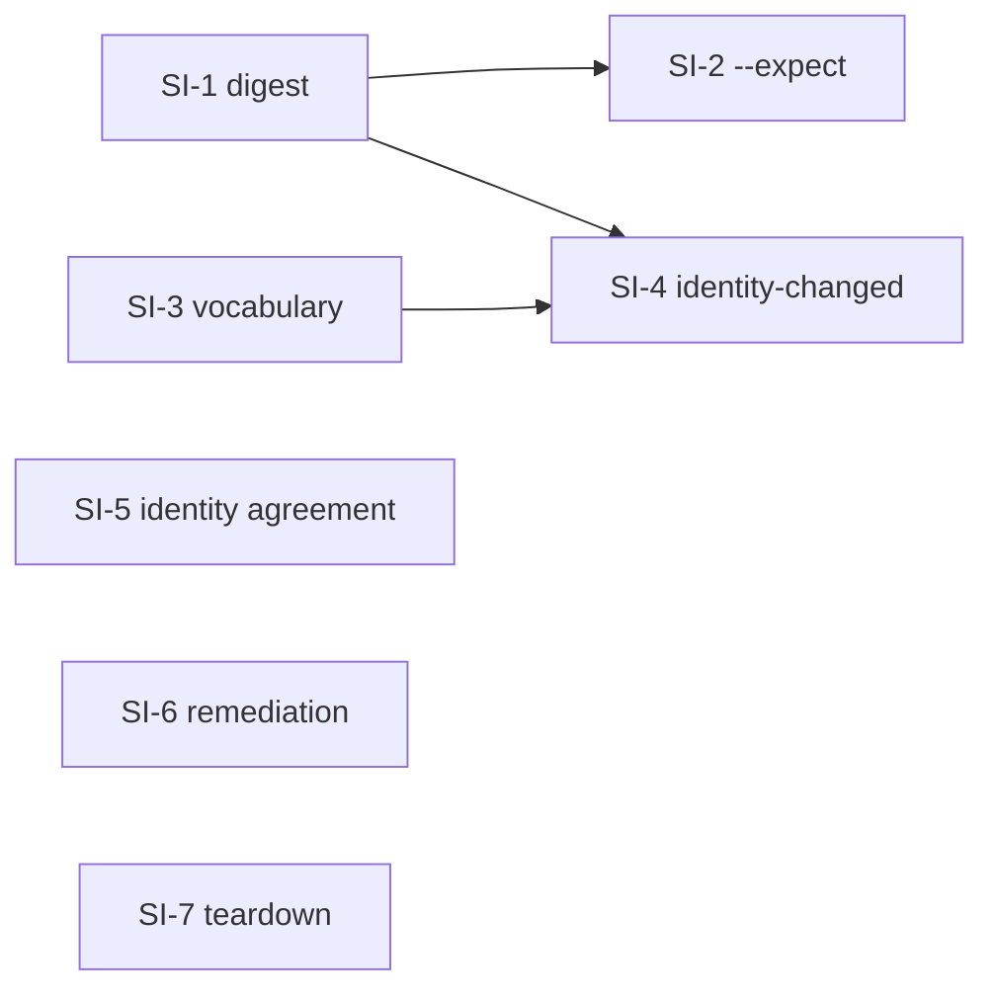

# Plan: subscription identity binding

Status: **not started.** Implements
[the design](../design/DESIGN-subscription-identity-binding.md), which composes the response to
[live acceptance v2](../testing/PROGRESS-live-acceptance-v2.md).

Sequenced by boundary, not by finding. Every work package ends with stdlib/`unittest` coverage and a
clean `git diff --check`. Run tests with `python3 -m unittest discover -s tests -p "*_test.py"`;
`make quality` gates the branch.

## Guardrails

- **No refusal is loosened.** Three of these packages add a second gate; none removes one.
- **No source operation writes beneath a project.** `tests/source_project_isolation_test.py` is not
  modified by this work. If a package needs it changed, the package is wrong.
- **No protocol, schema, or on-disk format changes.** `identity-changed` is computed, never stored;
  `2.0.0` ↔ `2.1.x` data-root interoperability stays true and gets a test.
- **Review-first everywhere it already is.** `--expect` is additive; `--yes` alone keeps its meaning.

## SI-1 — the plan digest stops being a clock

**Files:** `agent_artifacts/installation/model.py`

1. Remove `source_age_seconds` from `_plan_review_value`. Keep the field on `InstallPlan` and keep it
   in the rendered review — freshness is information for the operator, not identity of the plan.
2. Audit the remaining inputs for anything else derived from wall-clock or from process state.

**Tests:** two reviews of one plan built from identical inputs at different simulated times produce
one digest; a real end-to-end double review, seconds apart, agrees.

**Exit:** design §5's first half. This lands first because every other package's tests become
deterministic once it does.

## SI-2 — `--expect`, a reviewed decision that survives a second command

**Files:** `agent_artifacts/cli.py`, `agent_artifacts/commands/marketplace.py`,
`agent_artifacts/commands/source.py`, consumer and source application layers

1. Add `--expect <digest>` to every review-first consumer command; finalize only when the recomputed
   review digest matches, otherwise refuse and render the new review.
2. Add `--expect <from>:<to>` to `source resubscribe`, passing the parsed pair as the existing
   `SourceIdentityTransition` expectation — the value already carries both sides for this purpose.
3. State the refusal in one typed diagnostic naming what changed.

**Tests:** finalize with a stale `--expect` refuses and mutates nothing; with a current one it
finalizes; `resubscribe --expect` refuses an origin that moved after the review; `--yes` without
`--expect` is unchanged.

**Exit:** design §5. Depends on SI-1 — without it, `--expect` would be unusable by construction.

## SI-3 — resolution failure names the layer that failed

**Files:** `agent_artifacts/consumer/`, `agent_artifacts/application/`, diagnostics

1. Split today's `artifact-not-found` into the four cases in design §3, each with its own
   remediation.
2. Remove source resolution from the uninstall path: uninstall plans from the manifest alone.
3. Keep `artifact-not-found` for the one case where it is true.

**Tests:** uninstall succeeds after `source remove` and leaves the project exactly as an ordinary
uninstall does; each of the four causes produces its own code; the cold-cache offline case reports
`source-not-synchronized` (closes v1 `LAF-19`).

**Exit:** design §3 and attractor A1.

## SI-4 — `identity-changed` reconciliation

**Files:** `agent_artifacts/consumer/` reconciliation and rendering,
`agent_artifacts/installation/model.py`

1. Resolve installation records through the subscription (alias, origin, ref); compare recorded
   `declared_id` against the subscription's current identity.
2. Add `identity-changed` as a reconciliation status beside `update-available` and
   `removed-upstream`, in both renderers.
3. Make `marketplace update` act on it: the review states both identities, and finalize rebinds the
   record.

**Tests:** install, adopt a new identity with `source resubscribe`, then in the project — `status`
reports `identity-changed`, review states both identities and changes nothing, `--yes` rebinds and
the next `status` is `current`; nothing under the project changed during the `resubscribe` itself.

**Exit:** design §2 and the criticality finding `LAF-33`. Depends on SI-3 for the vocabulary.

## SI-5 — the consumer checks the identity agreement

**Files:** source snapshot compilation

1. When a snapshot carries both `aart-registry.json` and `aart-source.json`, refuse a `registry_id` /
   `source_id` disagreement at acquisition.
2. One typed diagnostic naming both values and both files.

**Tests:** a fixture registry with disagreeing identities is refused by `source sync` and by
`source add`; a registry carrying only `aart-source.json` is unaffected.

**Exit:** design §2's second half, `LAF-37`. Independent of SI-3/SI-4.

## SI-6 — remediation reaches the operator

**Files:** `agent_artifacts/commands/source.py` renderer, `agent_artifacts/tui_sources.py`,
`tests/source_remediation_test.py`, `docs/release/`

1. Render remediation under per-source diagnostics in text mode.
2. Widen the dead-end guard from `Diagnostic.remediation` to every user-visible `aart …` mention in
   the package, and fix what it catches — starting with the `source doctor` reason in
   `tui_sources.py`.
3. Add renderer parity: for a representative refusal per command family, the remediation lines in
   text equal those in JSON.
4. Report lock-holder age and liveness in the stale-lock refusal; give the object-store failure a
   remediation line.
5. Record `source doctor`'s `2.0.0` removal in a compatibility addendum.

**Tests:** the widened guard fails on a planted stale command name; renderer parity holds for every
family; the stale-lock message states the age.

**Exit:** design §4 and attractor A3. Independent of every other package.

## SI-7 — teardown leaves the repository as it found it

**Files:** `agent_artifacts/consumer/` uninstall finalization

1. When the last installation for a scope is removed, remove the emptied manifest, its lock, and any
   profile directories the install created and left empty.
2. Never remove a directory that was not created by an install, and never one that is non-empty.

**Tests:** clean checkout → install → uninstall everything → `git status --porcelain` is empty; a
pre-existing `.claude/skills` with foreign content survives.

**Exit:** v1 `LAF-17`, unresolved across two runs.

## Dependency order

SI-1 first: it makes every downstream test deterministic. SI-5, SI-6, and SI-7 are independent of the
rest and of each other, so they can run in parallel from the start.

## Release shape

Additive: one new reconciliation status, one new flag on existing commands, three refusals that were
previously accepted or mis-typed. No protocol, schema, or format revision. That is a **minor** —
`2.2.0`, contract v10 — with the same "no registry precondition" property as `2.1.0`.

The three refusals are the part to be honest about in the release notes: a registry whose two
identity documents disagree, and two resolution cases that used to be reported as a missing artifact,
now fail differently. No registry that passes `registry validate --strict --frozen` is affected.

## Out of scope, by decision

Design §7's three open questions — byte-reproducible wheels (`LAF-30`), cross-registry `requires`
(`LAF-38`), and `source add`'s missing review (`LAF-39`) — are not in this plan. They need a
maintainer decision first, and two of the three would change a contract rather than fix a defect.
